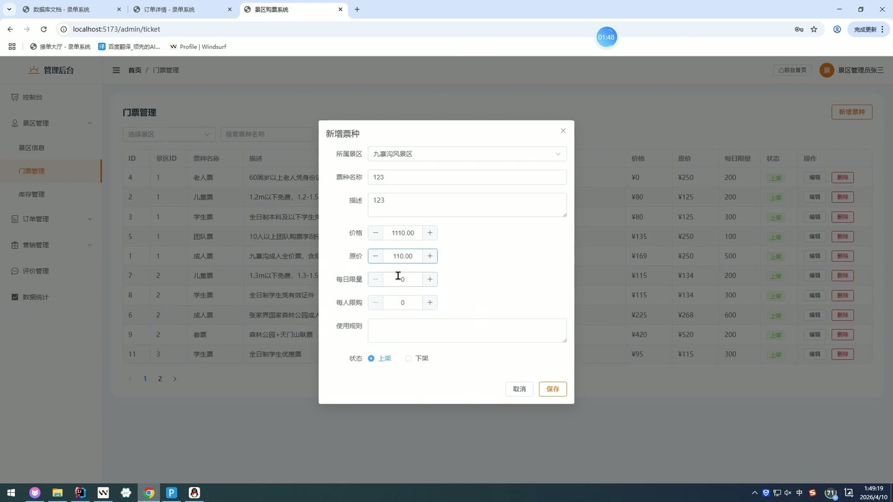
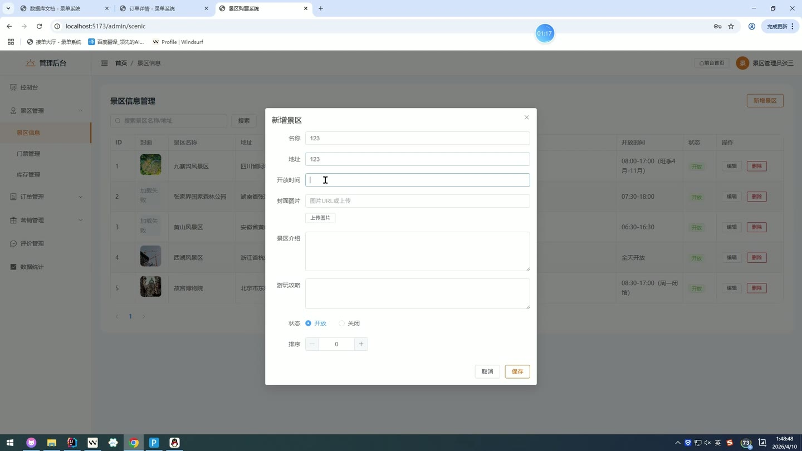
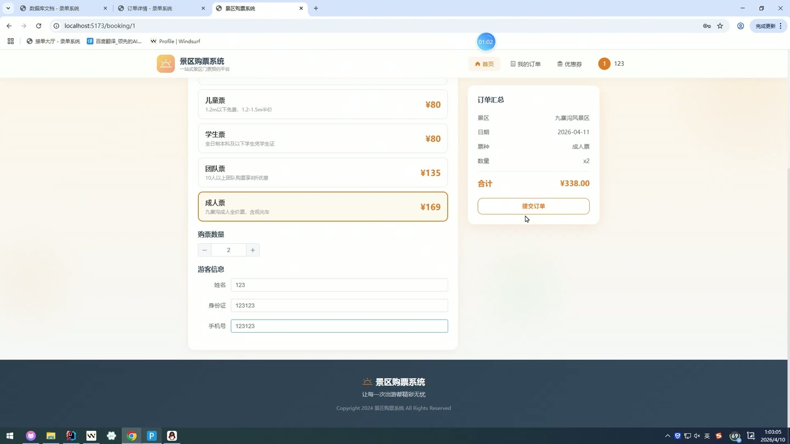

# (附文档)Springboot3+Vue3+MySQL 景区购票系统

**技术栈**：Springboot3、Vue3、MySQL

### 系统简介

本系统是一套基于 SpringBoot3 + Vue3 前后端分离架构的景区票务管理平台，支持普通用户在线购票、订单管理、评价反馈，以及管理员对景区、门票、库存、订单、检票、公告、优惠券、评价、用户、系统配置、日志和统计报表的全方位管理。
 
### 核心功能
 
### 普通用户端

 
- 浏览景区列表（仅展示状态为已开放的景区，按排序字段升序排列） 
- 查看景区详情（包含名称、描述、封面图、地址、开放时间、游玩贴士等信息） 
- 按景区查看门票类型列表（仅显示启用状态的票种，按价格升序排列） 
- 查询指定景区在指定日期的门票库存（返回每个票种的剩余数量） 
- 创建订单（选择景区、游览日期、票种及数量，支持填写游客姓名/身份证/手机号） 
- 在线支付订单（支付后自动扣减对应日期的门票库存） 
- 取消未支付的订单 
- 申请退票（已支付订单退票后自动恢复对应日期的库存） 
- 改期操作（已支付订单可申请变更游览日期，自动校验新日期库存是否充足） 
- 查看我的订单列表（支持按订单状态筛选，显示是否已评价标记） 
- 查看订单详情（包含订单基本信息、票种明细、是否已评价状态） 
- 管理常用游客信息（新增、删除常用游客，支持设置默认游客） 
- 领取优惠券（查看可领取的优惠券列表，每人每种限领一次） 
- 查看我的优惠券（显示已领取的优惠券及其使用状态） 
- 提交评价（对已完成的订单进行评分、填写评价内容、上传图片） 
- 查看我的评价列表（显示评价内容、对应景区名称、管理员回复等） 
- 修改个人资料（真实姓名、手机号、邮箱、头像） 
- 修改登录密码（需验证原密码） 
- 查看公告列表（仅显示已发布的公告，置顶公告优先展示） 
- 查看指定景区的公开评价（仅显示审核通过的评价，最多返回20条） 
- 用户注册（填写用户名、密码，默认角色为普通用户） 
- 用户登录（验证用户名密码、账号状态，返回JWT令牌及用户信息）
 
### 管理员端

 
- 景区管理：分页查询景区列表（支持按名称/地址关键词搜索）、新增景区、编辑景区、删除景区 
- 门票类型管理：分页查询门票（支持按景区筛选、按名称关键词搜索）、新增票种、编辑票种、删除票种 
- 门票库存管理：分页查看库存记录（支持按景区和日期筛选，展示票种名称和景区名称）、新增库存记录（自动校验同票种同日期是否已存在）、编辑库存数量 
- 订单管理：分页查询所有订单（支持按订单状态和订单号关键词筛选）、查看订单详情（含订单信息和明细列表）、修改订单状态、执行退款操作 
- 检票核销：输入票号进行核销（核销后标记该票已使用并记录核销时间、渠道、操作人）、分页查看核销记录 
- 公告管理：分页查询公告（支持按标题关键词和公告类型筛选）、新增公告、编辑公告、删除公告 
- 优惠券管理：分页查询优惠券（支持按名称关键词搜索）、新增优惠券、编辑优惠券、删除优惠券 
- 评价管理：分页查看所有评价（支持按景区筛选，展示评价用户和景区名称）、回复评价、删除评价 
- 用户管理：分页查询用户（支持按关键词和角色筛选）、修改用户状态/角色/真实姓名/手机号、删除用户 
- 系统配置：查看所有配置项列表、编辑配置项的值 
- 日志管理：分页查看系统操作日志（支持按日志类型和关键词筛选） 
- 统计报表：查看总订单数、已支付订单数、总收入、今日订单数（支持按景区筛选）
 
### 技术栈

 后端框架Spring Boot 3.x ORMMyBatis-Plus（分页插件） 权限认证JWT（令牌校验拦截器） 前端框架Vue 3（Composition API） 路由管理Vue Router（路由守卫鉴权） 构建工具Vite 数据库MySQL（逻辑删除支持） 工具库Hutool、Lombok、Jackson
 
### 交付内容

 
- 后端完整源码 
- 前端完整源码 
- 数据库初始化脚本 
- 万字文档

## 界面展示

---

## 获取完整源码 + 万字文档

本仓库为项目介绍页。**完整前后端源码、数据库初始化脚本、万字项目文档**，请加微信 `kangkangcode`，或访问 [codekk.top](http://codekk.top) 获取。

可作课程设计 / 毕业设计参考，支持远程部署调试。